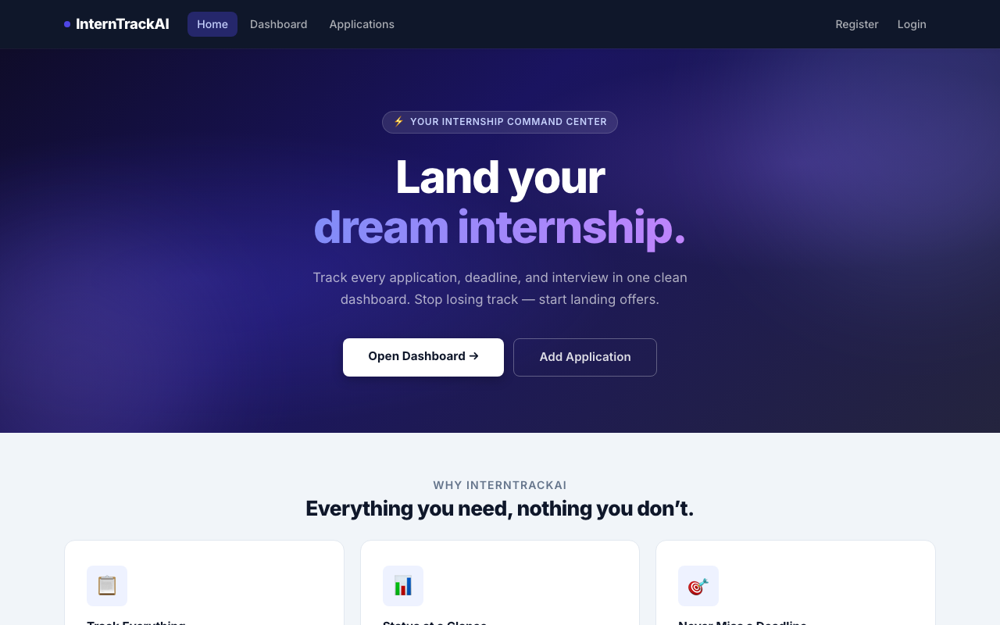
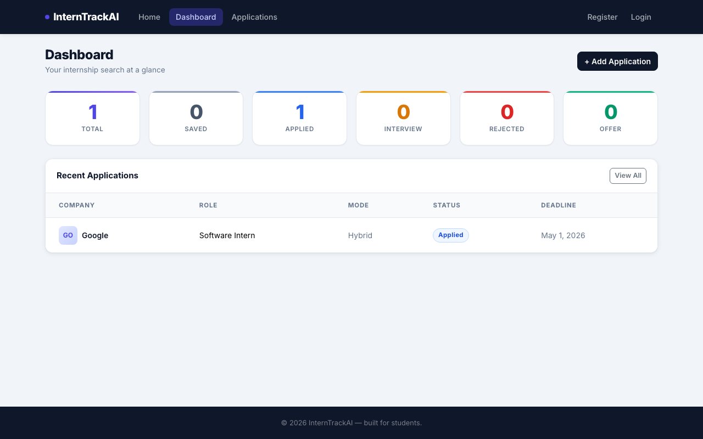
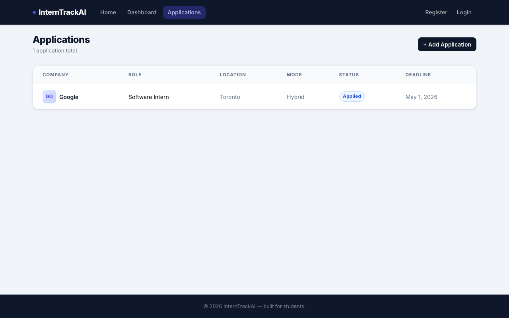
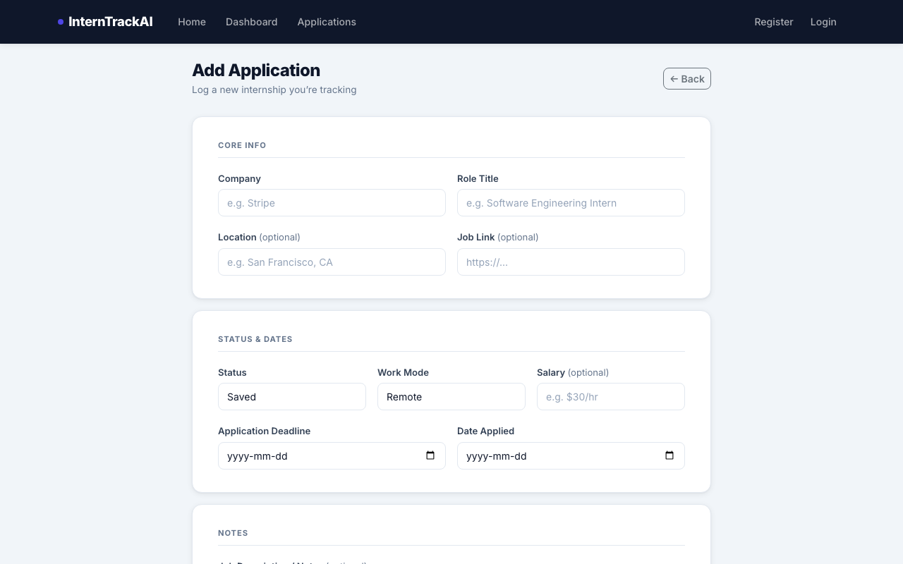

# InternTrackAI

An internship application tracker built with ASP.NET Core 9 MVC. Log every application, track its status through the pipeline, and never miss a deadline.

## Screenshots

### Home


### Dashboard


### Applications


### Add Application


## Tech Stack

- ASP.NET Core 9 MVC
- Entity Framework Core + SQLite
- ASP.NET Core Identity (auth)
- Bootstrap 5

## Running Locally

```bash
git clone https://github.com/MajdArow123/InternTrackAI.git
cd InternTrackAI
dotnet run
```

Open [http://localhost:5240](http://localhost:5240).

## Status

**Phase 1 — complete**
- Hero homepage
- Stats dashboard (total, per-status counts, recent applications)
- Applications table with color-coded status badges
- Add Application form
- ASP.NET Identity wired up (register/login UI scaffolded)

**Coming up**
- Edit and delete applications
- Per-user data isolation (auth enforcement)
- AI-powered suggestions and autofill

## Author

Majd Arow
