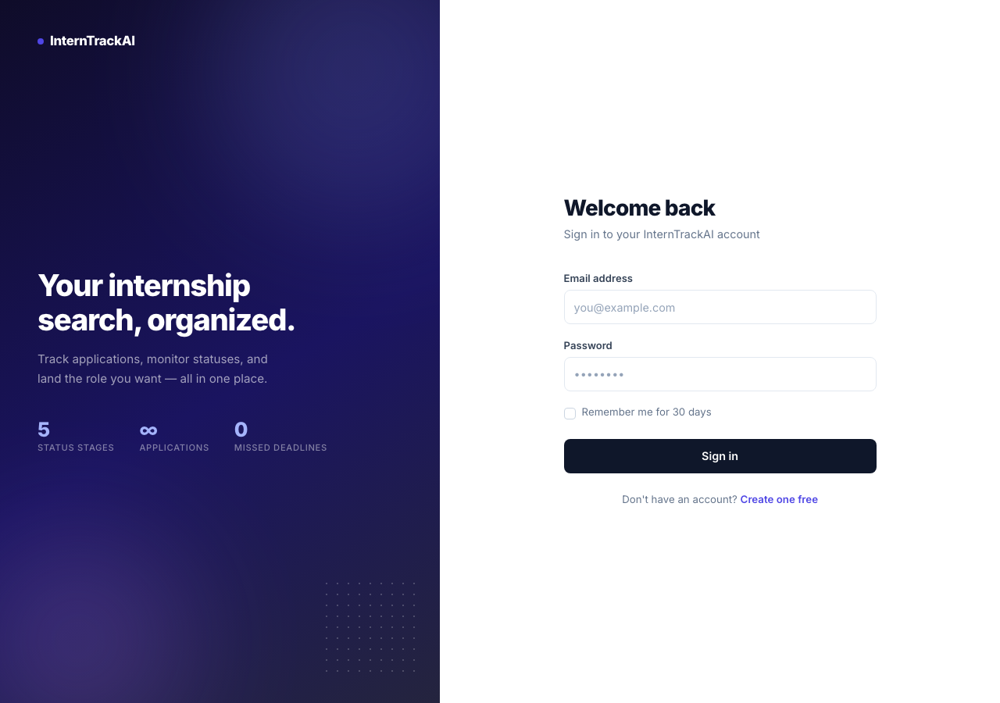
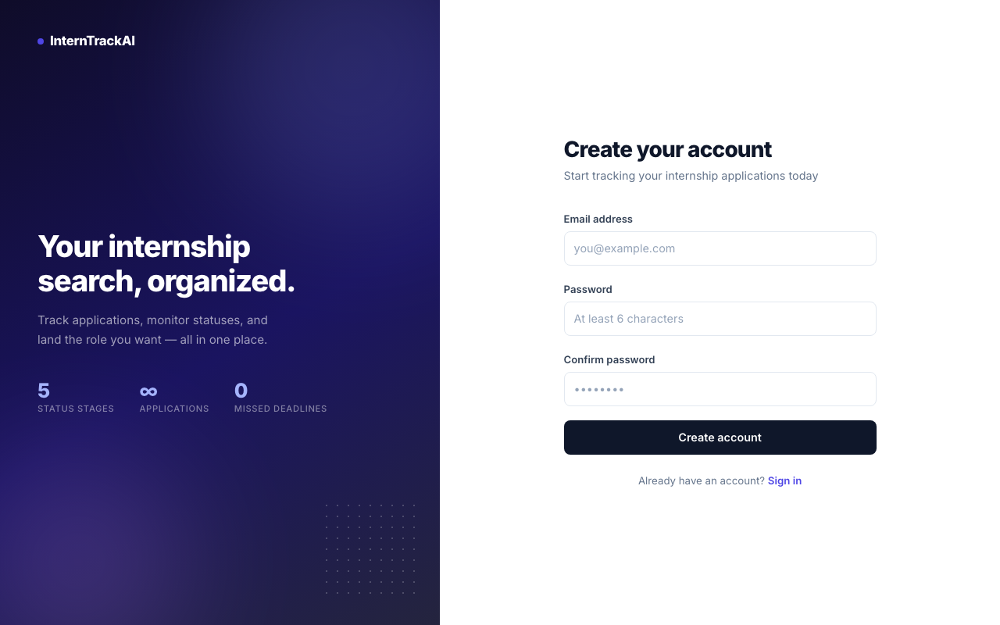

# InternTrackAI

A full-stack internship application tracker built with ASP.NET Core 9 MVC. Track every application through the entire pipeline — from saved to offer — with an AI-powered job description analyzer that auto-fills your form in seconds.

## Screenshots

| Home | Dashboard |
|------|-----------|
|  |  |

| Applications | Add Application |
|---|---|
|  |  |

| Sign In | Register |
|---|---|
|  |  |

## Features

**Phase 1 — Core Tracker**
- Add, edit, and delete internship applications
- Track status through five stages: Saved, Applied, Interview, Offer, Rejected
- Color-coded status badges and per-status stat cards on the dashboard
- Company avatar initials, deadline tracking, work mode, salary, and notes
- Responsive Bootstrap 5 layout with dark navbar and Inter typography
- Split-screen login and register pages with ASP.NET Core Identity

**Phase 2 — AI Analyzer**
- Paste a job description **or a job posting URL** and click Analyze
- URLs are auto-detected — the page is fetched and parsed server-side before analysis
- GPT-4o-mini extracts company name, role title, location, salary, and up to 8 required skills
- Extracted data auto-fills the form with an animated highlight effect; Job Link field populated from URL input
- Skill tags displayed inline after analysis
- CSRF-protected JSON API endpoint

## Tech Stack

| Layer | Technology |
|---|---|
| Framework | ASP.NET Core 9 MVC |
| Database | SQLite via Entity Framework Core 9 |
| Auth | ASP.NET Core Identity |
| AI | OpenAI API — GPT-4o-mini |
| Frontend | Bootstrap 5, Vanilla JS (fetch) |
| Fonts | Inter (Google Fonts) |

## Getting Started

**Prerequisites:** .NET 9 SDK, an OpenAI API key

```bash
git clone https://github.com/MajdArow123/InternTrackAI.git
cd InternTrackAI
```

Add your OpenAI key to `appsettings.json` (this file is gitignored and must be created locally):

```json
{
  "ConnectionStrings": {
    "DefaultConnection": "Data Source=app.db"
  },
  "OpenAI": {
    "ApiKey": "sk-..."
  },
  "Logging": {
    "LogLevel": {
      "Default": "Information",
      "Microsoft.AspNetCore": "Warning"
    }
  },
  "AllowedHosts": "*"
}
```

Run the app:

```bash
dotnet run
```

Open [http://localhost:5240](http://localhost:5240). Register an account to get started.

> The AI analyzer requires billing credits on your OpenAI account. Add them at [platform.openai.com/settings/billing](https://platform.openai.com/settings/billing). GPT-4o-mini costs roughly $0.00015 per analysis.

## Project Structure

```
Controllers/
  HomeController.cs           # Homepage + dashboard (queries DB for stats)
  JobApplicationsController.cs # CRUD for applications
  AnalyzerController.cs       # POST /Analyzer/Analyze — calls OpenAI

Models/
  JobApplication.cs           # Core entity
  Enums/ApplicationStatus.cs  # Saved | Applied | Interview | Offer | Rejected
  Enums/WorkMode.cs           # Remote | Hybrid | OnSite
  ViewModels/DashboardViewModel.cs
  ViewModels/JobAnalysisResult.cs

Services/
  JobAnalyzerService.cs       # URL fetch + HTML strip + OpenAI chat completions

Views/
  Home/Index.cshtml           # Hero landing page
  Home/Dashboard.cshtml       # Stats + recent applications
  JobApplications/            # Index, Create, Edit, Delete
  Shared/_Layout.cshtml       # Main layout (dark navbar)
  Shared/_AuthLayout.cshtml   # Split-screen auth layout

Data/
  ApplicationDbContext.cs     # EF Core + Identity DbContext
  Migrations/                 # SQLite migrations
```

## Author

Majd Arow
