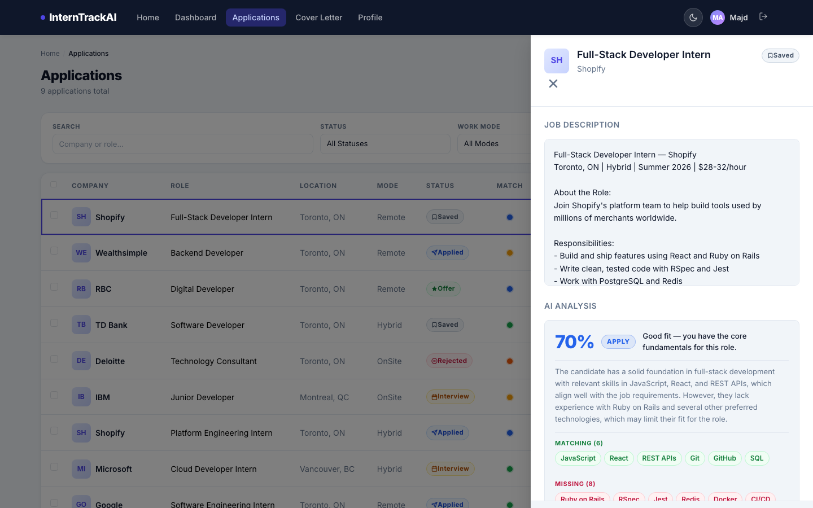
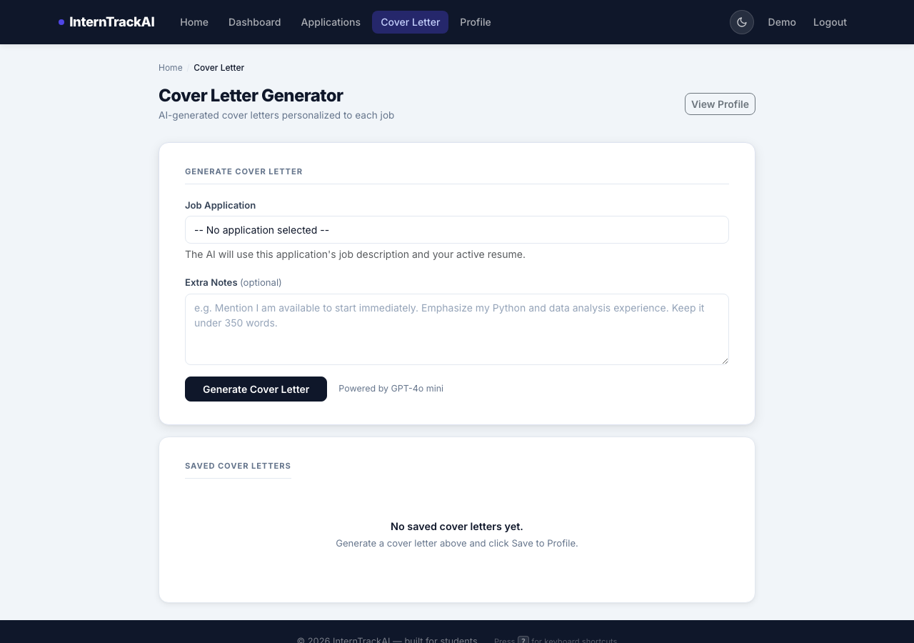
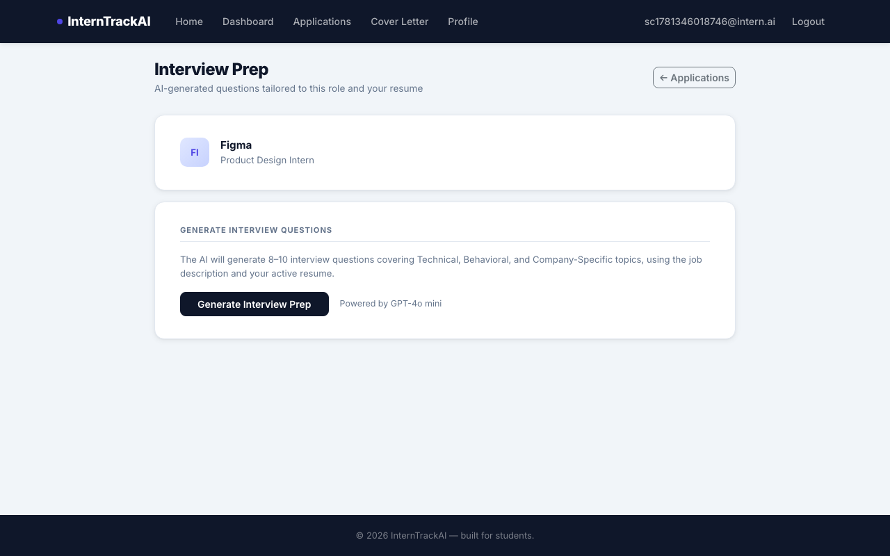
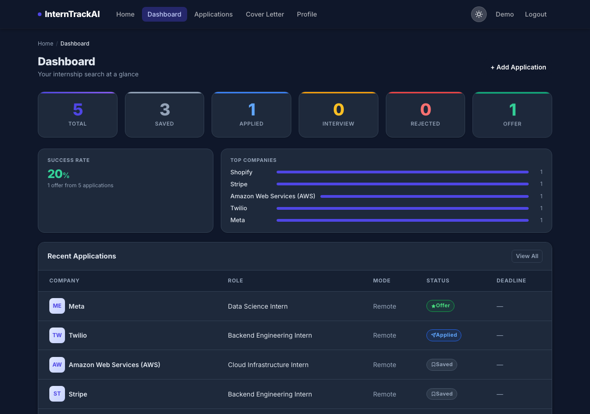
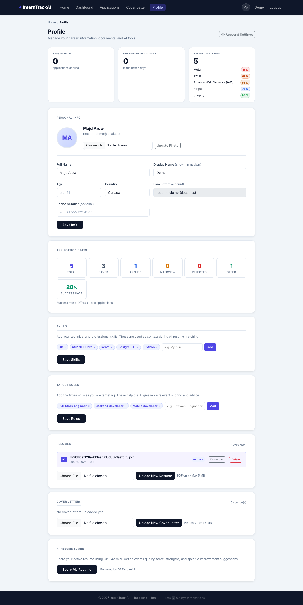

# InternTrackAI

**Your internship search, organized — with AI doing the busywork.**

[](https://dotnet.microsoft.com/)
[](https://learn.microsoft.com/aspnet/core)
[](https://platform.openai.com/)
[](https://interntrackai-production.up.railway.app)
[](LICENSE)

InternTrackAI is a full-stack internship application tracker built with ASP.NET Core 9 MVC. It replaces the typical spreadsheet with a real pipeline: paste a job posting and let AI fill out the form, see instantly how well your resume matches, track every application through five stages, and generate cover letters and interview prep on demand — all in one place.

## 🚀 Live Demo

**[interntrackai-production.up.railway.app](https://interntrackai-production.up.railway.app)**

A permanent demo account is seeded with a sample profile, a resume, and 5 job applications spanning every match-score tier, so you can explore everything immediately without signing up:

| | |
|---|---|
| **Email** | `demo@interntrackai.com` |
| **Password** | `CvjOukfKXS8YaAR7!` |

> The demo account is shared and public — please don't change its password or delete its data. Feel free to add, edit, or delete job applications to explore the AI features.

## ✨ Key Features

- 🧠 **AI-powered job analyzer** — paste a job description or URL and watch the form auto-fill with company, role, location, salary, and required skills
- 🎯 **Resume match scoring** — instantly see how well your resume matches a role, with a skill gap analysis showing exactly what you have and what's missing
- 📋 **Application tracking** — follow every application through 5 status stages: Saved, Applied, Interview, Offer, Rejected
- 🚦 **AI match score color indicators** — a 5-tier color system (green → red) gives you an at-a-glance read on fit, from APPLY to SKIP
- 📂 **Slide-out detail drawer** — click any application for the full job description and a complete AI analysis without leaving the list
- ✍️ **Cover letter generator** — AI writes a personalized cover letter using the job description, your resume, and your profile
- 🎤 **Interview prep tool** — generates tailored technical, behavioral, and company-specific questions with tips for each one
- 🌗 **Dark / light mode** — toggle in the navbar, persisted across sessions
- 🔐 **Password reset flow** — full forgot-password / reset-password flow via ASP.NET Core Identity

## 🛠️ Tech Stack

| Layer | Technology |
|---|---|
| Framework | ASP.NET Core 9 (C#) |
| Database | SQLite (local) / PostgreSQL (production), via Entity Framework Core 9 |
| Frontend | Bootstrap 5, vanilla JavaScript — Razor views, no SPA framework |
| AI | OpenAI API (GPT-4o-mini) |
| Auth | ASP.NET Core Identity |
| Hosting | Railway (Docker) |

## 📸 Screenshots

| Sign In | Dashboard |
|---|---|
|  |  |

| Applications | Detail Drawer |
|---|---|
|  |  |

| Add Application — AI Analysis + Resume Match |
|---|
|  |

| Cover Letter | Interview Prep |
|---|---|
|  |  |

| Dark Mode | Profile |
|---|---|
|  |  |

## 💻 How to Run Locally

**Prerequisites:** .NET 9 SDK, an OpenAI API key

```bash
git clone https://github.com/MajdArow123/InternTrackAI.git
cd InternTrackAI
```

Set your OpenAI API key using .NET User Secrets (never stored in source files):

```bash
dotnet user-secrets set "OpenAI:ApiKey" "sk-..."
```

Run the app:

```bash
dotnet run
```

Open [http://localhost:5240](http://localhost:5240) and register an account to get started. Locally, the app uses a SQLite file (`app.db`) created automatically via EF Core migrations — no extra database setup needed.

> AI features require billing credits on your OpenAI account, added at [platform.openai.com/settings/billing](https://platform.openai.com/settings/billing). GPT-4o-mini costs roughly $0.00015 per analysis.

## ☁️ Deployment

The live instance runs on [Railway](https://railway.app), built directly from the `Dockerfile` in this repo:

- **Database** — Railway-managed PostgreSQL. `Program.cs` detects the `DATABASE_URL` environment variable Railway injects and switches the EF Core provider from SQLite to Npgsql automatically.
- **Persistent storage** — uploaded resumes, cover letters, and profile photos are written to a mounted Railway volume so files survive redeploys.
- **Data Protection keys** — persisted to the database so antiforgery tokens and cookies stay valid across container restarts.
- **Migrations** — applied automatically on startup, so deploying a new migration is just a `git push`.

To deploy your own copy: create a Railway project, add a PostgreSQL service, attach a volume mounted at `/app/uploads`, set the `OpenAI:ApiKey` config variable, and point Railway at this repo — `railway.toml` already configures the build and health check.

## License

Released under the [MIT License](LICENSE).

## Author

Majd Arow
