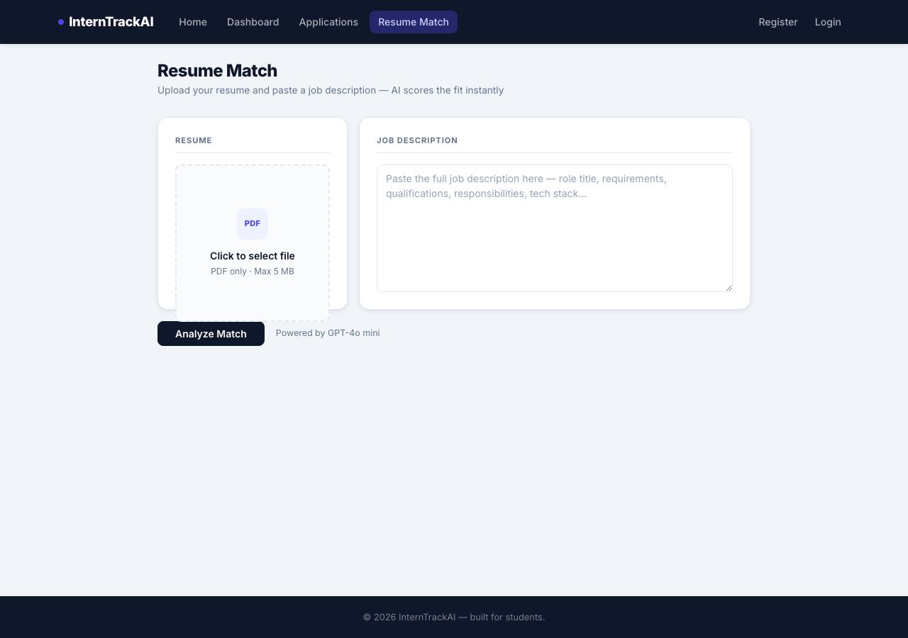

# InternTrackAI

[](https://dotnet.microsoft.com/)
[](https://learn.microsoft.com/aspnet/core)
[](https://platform.openai.com/)
[](https://interntrackai-production.up.railway.app)
[](LICENSE)

A full-stack internship application tracker built with ASP.NET Core 9 MVC. Track every application through the entire pipeline — from saved to offer — with AI-powered job analysis, resume matching, cover letter generation, interview prep, and a full career portfolio system.

## 🚀 Try It Live

**[interntrackai-production.up.railway.app](https://interntrackai-production.up.railway.app)**

A permanent demo account is seeded with a sample profile, a resume, and 5 job applications spanning every resume-match tier (APPLY → SKIP), so you can explore the dashboard, analytics, and AI features immediately without signing up:

| | |
|---|---|
| **Email** | `demo@interntrackai.com` |
| **Password** | `CvjOukfKXS8YaAR7!` |

> The demo account is shared and public — please don't change its password or delete its data. Feel free to add, edit, or delete job applications to explore the AI features; the seeded sample data demonstrates all 5 match-score tiers across the Dashboard and Applications views.

## Screenshots

| Home | Dashboard |
|------|-----------|
|  |  |

| Applications | Add Application |
|---|---|
|  |  |

| Cover Letter | Interview Prep |
|---|---|
|  |  |

| Resume Match | Profile |
|---|---|
|  |  |

| Dark Mode | Sign In |
|---|---|
|  |  |

| Register | |
|---|---|
|  | |

## Features

**Phase 1 — Core Tracker**
- Add, edit, and delete internship applications
- Track status through five stages: Saved, Applied, Interview, Offer, Rejected
- Color-coded status badges and per-status stat cards on the dashboard
- Company avatar initials, deadline tracking, work mode, salary, and notes
- Responsive Bootstrap 5 layout with dark navbar and Inter typography
- Split-screen login and register pages with ASP.NET Core Identity

**Phase 2 — AI Job Analyzer**
- Paste a job description **or a job posting URL** and click Analyze
- URLs are auto-detected — the page is fetched and parsed server-side before analysis
- GPT-4o-mini extracts company name, role title, location, salary, and up to 8 required skills
- Extracted data auto-fills the form with an animated highlight effect
- After analysis, automatically runs a resume match against the user's active resume (if uploaded) and shows a score, 5-tier recommendation, and matching/missing skill breakdown

**Phase 3 — Career Portfolio (`/Profile`)**
- Personal info: full name, age, country, phone, profile photo
- Resume management: upload PDFs, full version history, set any version as Active, download or delete
- Cover letter management: same version history system as resumes
- Skills profile: tag-based input, saved to profile, used as AI context
- Target roles: save job types you are pursuing (e.g. Software Engineering Intern)
- Application stats: total count, per-status breakdown, success rate percentage
- AI Resume Score: sends active resume to GPT-4o-mini and returns a score, strengths, and specific improvement suggestions

**Phase 4 — AI Cover Letter Generator (`/CoverLetter/Generate`)**
- Select any tracked job application and click Generate — AI writes a personalized 3–4 paragraph cover letter
- Pulls context from the job's description, your active resume, your profile skills, target roles, and name
- Optional notes field to guide tone, length, or specific talking points
- Editable output textarea with live word count, copy to clipboard, and download as PDF (client-side via jsPDF)
- Save to profile with automatic version numbering and per-letter company/role snapshot
- Saved letter history with Load, Set Active, Download (.txt), and Delete actions
- "Cover Letter" button on every row of the Applications list for one-click access

**Phase 5 — Search, Filter, and Bulk Actions**
- Search applications by company name or role title
- Filter by status and work mode; sort by deadline, date applied, status, or company name
- Select multiple applications with checkboxes and a select-all header
- Bulk delete or bulk status change via a fixed action bar that appears at the bottom of the screen
- Export all applications to CSV with one click (company, role, location, mode, status, dates, salary, link)

**Phase 6 — AI Interview Prep (`/InterviewPrep/Prep/{appId}`)**
- Generate 8–10 interview questions tailored to the specific job description and your resume
- Questions are categorized into Technical, Behavioral, and Company-Specific
- Each question includes a tip on how to approach answering it
- Results are saved per application and can be regenerated at any time
- "Interview Prep" button on every row of the Applications list for one-click access

**Phase 7 — Security, Error Handling, and Resume Match Redesign**
- OpenAI API key stored in .NET User Secrets — never committed to source control
- PDF uploads validated by magic bytes (`%PDF` signature) in addition to file extension, preventing disguised file uploads
- Uploaded filenames sanitized before being stored in the database
- All AI features (Job Analyzer, Resume Score, Cover Letter, Interview Prep) return clear, actionable error messages for invalid keys, rate limits, and network failures
- Custom 404 and 500 error pages matching the site design instead of the default ASP.NET pages
- Resume Match redesigned with a 5-tier score system: **APPLY** (80–100%, green), **APPLY** (60–79%, blue), **MAYBE** (40–59%, amber), **CONSIDER SKIPPING** (20–39%, orange), **SKIP** (0–19%, red)
- Match card shows the score prominently, a color-coded recommendation badge, tier description, AI summary, and matching/missing skills with counts

**Phase 8 — Animation & Visual Polish**
- Fade-in transitions on cards, hover scale effects, and an animated SVG score ring on the match card
- Dashboard stat counters animate on load; toast notifications slide in; auth pages have entrance animations
- Shimmer loading effect and a gradient hero on the homepage

**UX Polish Pass**
- **Dark Mode** — toggle in the navbar, persisted via `localStorage`, theme applied before first paint to avoid a flash of the wrong theme
- **Dashboard Analytics** — success rate, top companies, upcoming-deadline alerts (next 3 days), and follow-up suggestions for applications sitting 7+ days without movement
- **Profile Quick Stats** — applications this month, upcoming deadlines, and recent resume match scores at a glance
- **Keyboard Shortcuts** — `?` opens a shortcut guide, `N` new application, `D` dashboard, `C` cover letter, `P` profile, `S` focus search, `Esc` close
- **Status Icons** — inline SVG icons inside every status badge across the Dashboard and Applications views
- **Job Comparison Tool** — select 2–3 applications and compare them side by side in a modal
- **Empty State Illustrations** — custom inline SVG illustrations instead of blank tables when there's no data yet
- **Breadcrumb Navigation** — on every interior page for quick orientation and back-navigation

**Quality of Life**
- Duplicate detection on the Add Application form — warns before saving if the same company and role already exists, with an option to save anyway
- Toast notifications on all mutating actions (save, update, delete, bulk operations, cover letter save)
- Consistent empty states throughout: Applications list, Cover Letter history, Interview Prep

## Tech Stack

| Layer | Technology |
|---|---|
| Framework | ASP.NET Core 9 MVC |
| Database | PostgreSQL in production (Railway, via Npgsql) · SQLite in local development — both via Entity Framework Core 9 |
| Auth | ASP.NET Core Identity |
| AI | OpenAI API — GPT-4o-mini |
| PDF | PdfPig (server-side text extraction), jsPDF (client-side generation) |
| Frontend | Bootstrap 5, Vanilla JS (fetch) — Razor views, no SPA framework |
| Fonts | Inter (Google Fonts) |
| Hosting | Railway (Docker build, managed Postgres, persistent volume for uploads) |

## Installation & Setup

**Prerequisites:** .NET 9 SDK, an OpenAI API key

```bash
git clone https://github.com/MajdArow123/InternTrackAI.git
cd InternTrackAI
```

Set your OpenAI API key using .NET User Secrets (the key is never stored in source files):

```bash
dotnet user-secrets set "OpenAI:ApiKey" "sk-..."
```

Run the app:

```bash
dotnet run
```

Open [http://localhost:5240](http://localhost:5240). Register an account to get started.

Locally, the app uses a SQLite file (`app.db`) created automatically via EF Core migrations — no extra database setup needed.

> The AI features require billing credits on your OpenAI account. Add them at [platform.openai.com/settings/billing](https://platform.openai.com/settings/billing). GPT-4o-mini costs roughly $0.00015 per analysis.

## Deployment

The live instance runs on [Railway](https://railway.app), built directly from the `Dockerfile` in this repo:

- **Database** — Railway-managed PostgreSQL. `Program.cs` detects the `DATABASE_URL` environment variable Railway injects and switches the EF Core provider from SQLite to Npgsql automatically; no code changes needed between environments.
- **Persistent storage** — uploaded resumes, cover letters, and profile photos are written to disk (`/app/uploads`), which is backed by a mounted Railway volume so files survive redeploys and restarts.
- **Data Protection keys** — persisted to the database (`PersistKeysToDbContext`) so antiforgery tokens and cookies stay valid across container restarts.
- **Migrations** — applied automatically on startup (`db.Database.Migrate()`), so deploying a new migration is just a `git push`.
- **TLS / proxying** — Railway terminates TLS at its edge proxy; the app trusts forwarded headers (`X-Forwarded-For`/`X-Forwarded-Proto`) and skips its own HTTPS redirect in production.

To deploy your own copy: create a Railway project, add a PostgreSQL service, attach a volume mounted at `/app/uploads`, set the `OpenAI:ApiKey` config variable, and point Railway at this repo — `railway.toml` already configures the Dockerfile build and health check.

## Project Structure

```
Controllers/
  HomeController.cs             # Homepage + dashboard
  JobApplicationsController.cs  # CRUD, search/filter, bulk actions, CSV export
  AnalyzerController.cs         # POST /Analyzer/Analyze — job description parser
  ProfileController.cs          # Full profile + document management + AI scoring
  CoverLetterController.cs      # AI cover letter generation, save, download, delete
  InterviewPrepController.cs    # AI interview prep generation + session storage

Models/
  JobApplication.cs             # Core application entity
  GeneratedCoverLetter.cs       # AI-generated cover letter entity (version history)
  InterviewPrepSession.cs       # AI interview prep session (one per application)
  InterviewQuestion.cs          # Interview question record (category, question, tip)
  UserProfile.cs                # Personal info, skills JSON, target roles JSON
  ResumeVersion.cs              # Resume file metadata + version history
  CoverLetterVersion.cs         # Cover letter file metadata + version history
  Enums/ApplicationStatus.cs    # Saved | Applied | Interview | Offer | Rejected
  Enums/WorkMode.cs             # Remote | Hybrid | OnSite
  ViewModels/                   # DashboardViewModel, CoverLetterGeneratorViewModel,
                                #   InterviewPrepViewModel, JobAnalysisResult,
                                #   ResumeMatchResult, ResumeScoreResult, ProfileViewModel

Services/
  JobAnalyzerService.cs         # URL fetch + HTML strip + OpenAI extraction
  ResumeMatcherService.cs       # PDF text extraction + OpenAI match scoring
  ResumeScoreService.cs         # OpenAI resume quality scoring + suggestions
  CoverLetterGeneratorService.cs # OpenAI cover letter generation
  InterviewPrepService.cs       # OpenAI interview question generation

Views/
  Home/Index.cshtml             # Hero landing page
  Home/Dashboard.cshtml         # Stats + recent applications table
  JobApplications/              # Index (filter bar + bulk actions), Create, Edit, Delete
  CoverLetter/Generate.cshtml   # AI cover letter generator + saved letter history
  InterviewPrep/Prep.cshtml     # AI interview prep generator + question cards
  Profile/Index.cshtml          # Career portfolio (all sections)
  Shared/_Layout.cshtml         # Main layout with dark navbar + toast notifications
  Shared/_AuthLayout.cshtml     # Split-screen auth layout

Data/
  ApplicationDbContext.cs       # EF Core + Identity DbContext
  Migrations/                   # EF Core migrations (SQLite-generated, Npgsql-compatible)

uploads/                        # Server-side file storage (gitignored; Railway volume in production)
  resumes/{userId}/             # Resume PDFs — served via controller, not public
  coverletters/{userId}/        # Cover letter PDFs — served via controller
wwwroot/uploads/photos/         # Profile photos — served as static files

Dockerfile                      # Multi-stage build used for the Railway deployment
railway.toml                    # Railway build/deploy configuration
```

## Contributing

This is a personal portfolio project, but issues and pull requests are welcome — feel free to open one if you spot a bug or have a suggestion.

## License

Released under the [MIT License](LICENSE).

## Author

Majd Arow
