# InternTrackAI

**Your internship search, organized — with AI doing the busywork.**

[](https://github.com/MajdArow123/InternTrackAI/actions/workflows/ci.yml)
[](https://dotnet.microsoft.com/)
[](https://learn.microsoft.com/aspnet/core)
[](https://platform.openai.com/)
[](https://interntrackai-production.up.railway.app)
[](LICENSE)

InternTrackAI is a full-stack internship application tracker built with ASP.NET Core 9 MVC. It replaces the typical spreadsheet with a real pipeline: paste a job posting and let AI fill out the form, see instantly how well your resume matches, track every application through five stages, and generate cover letters and interview prep on demand — all in one place, in a clean Apple-style interface with full dark mode.

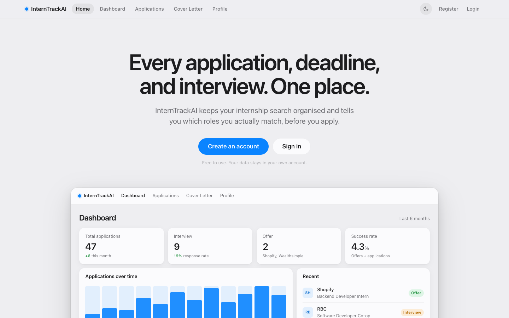

## 🚀 Live Demo

**[interntrackai-production.up.railway.app](https://interntrackai-production.up.railway.app)**

Click **Try the live demo** on the landing page to be signed straight into a demo account with a sample profile, a resume, and job applications spanning every match-score tier. No signup needed.

If you'd rather sign in manually:

| | |
|---|---|
| **Email** | `demo@interntrackai.com` |
| **Password** | `CvjOukfKXS8YaAR7!` |

> The demo account is shared and public — please don't change its password or delete its data. Feel free to add, edit, or delete job applications to explore the AI features.

## ✨ Key Features

**AI tools**

- 🧠 **Job analyzer** — paste a job description or URL and the form auto-fills with company, role, location, salary, required skills, and the application deadline when the posting states one
- 🎯 **Resume match scoring** — a 0–100 match ring for every role, with matched and missing skills side by side and a plain-language summary
- ✍️ **Cover letter generator** — a personalized letter written from the posting, your resume, and your profile; improve it with a one-line instruction, save versions, and download as PDF
- 📨 **Follow-up email drafts** — for every application that's waiting on a reply, *Draft follow-up* (on the dashboard Attention card and in the application drawer) writes a short, specific follow-up from what the app already knows: the posting, when you applied, your profile, resume, saved cover letter and notes. A second follow-up acknowledges the first, a 30+ day wait becomes a brief closing-the-loop check, and it never invents referrals, names or timelines. Edit it in place, revise it with a one-line instruction, and copy subject and body into your mail client; nothing is stored
- 🎤 **Interview prep** — technical, behavioral, and company-specific questions with tips, plus AI feedback on your written answers
- 💵 **Salary insight** — a typical pay range for the role, company, and location while you're filling in the form
- 📄 **Resume tools** — every upload auto-fills your name, skills, and target roles from the resume (adds, never removes; re-run any time with Analyze with AI), and Score my resume rates it with strengths and improvements

**Tracking**

- 📋 **Five-stage pipeline** — Saved, Applied, Interview, Offer, Rejected, with status filter pills, search, and sorting
- 🗂️ **Kanban board** — drag cards between Saved, Applied, Interview, Offer, and Rejected columns (or move them with the keyboard); order and status save instantly, with the same filters as the list
- 📂 **Detail drawer** — the full posting, AI analysis, key details, a status timeline, and a notes log without leaving the list
- ✅ **Bulk actions** — select rows to change status, delete, or compare up to three applications side by side
- 📊 **Dashboard** — headline stats, an applications-over-time chart, a pipeline funnel, top companies, and an **Attention** card
- 📈 **Resume performance** — every application records which resume version it was sent with (defaults to the active resume, changeable on Create/Edit), and the dashboard compares versions side by side: applications sent, response rate (Interview or Offer), interviews, offers and average match score, with a computed one-line takeaway such as *"Backend focus has the best response rate so far (63% across 8 applications)"*. Rows with fewer than 5 applications are greyed as low confidence; resumes can be named inline on the profile, where each one also shows its sent count and response rate
- 🧩 **Skills you're missing most** — the dashboard aggregates the missing skills stored by every resume match (Applied or later; Saved is left out) into a ranked bar chart with a computed takeaway such as *"Docker came up in 6 of your 11 analyzed applications (55%)"*. Skills are compared case-insensitively and obvious variants are merged through a small alias map (Postgres → PostgreSQL, K8s → Kubernetes); pills filter by target role without a reload, and clicking a bar lists the applications behind it, each opening its drawer. No AI calls, and the card stays hidden until 3 applications have match data
- 🔔 **Follow-up reminders and deadline tracking** — one rule set (`ReminderService`) flags applications that are overdue (deadline passed, still Saved), due soon (deadline within 7 days), waiting on a reply (Applied for longer than your follow-up window, 3–30 days, set on the profile), or have an interview in the next 14 days. They show up on the dashboard with *Mark contacted* / *Snooze 3 days* buttons, as chips on the board, in the drawer, and behind a **Needs attention** filter on the list
- 📅 **Calendar export** — a private iCalendar feed URL (subscribe from Google Calendar or Apple Calendar; regenerate it any time) with every deadline, interview, and follow-up date, plus a one-click *Add to calendar* file for a single application
- 🌍 **Per-user time zone** — pick your IANA zone on the profile page; interview times, follow-up dates, note timestamps and every "N days" reminder are entered and shown in that zone while storage stays UTC, and the calendar feed emits interviews as local time with `TZID` + `VTIMEZONE` so Google and Apple Calendar show the right hour
- 🔁 **CSV import and export** — move your data in and out in one click
- 📬 **Gmail status suggestions** — connect your Gmail (read-only) and InternTrackAI watches for mail from the companies you've applied to; an AI pass turns interview invitations, offers and rejections into one-line suggestions on the dashboard, in the application drawer and as a dot on board cards. Accept applies the status (and the interview time when the email names one) and notes the change on the application; Dismiss just records your decision. Syncs every 30 minutes in the background or on demand from the profile
- 🔖 **Save from anywhere bookmarklet** — drag a button to your bookmarks bar, click it on any job posting (LinkedIn, Indeed, Glassdoor, company career pages), and a new tab opens with the Add Application form pre-filled by the AI analyzer; if a posting can't be read (login-walled pages), the form still opens with the link and title filled in

**Profile and account**

- 👤 **Profile** — photo, basic info, skill and target-role chips, versioned resumes with an active version, and your public GitHub repos
- 🌗 **Dark / light mode** — Apple-style design system with soft surfaces, pill buttons, and a frosted navbar; the toggle persists across sessions
- ⌨️ **Keyboard shortcuts** — press `?` anywhere for the list
- 🔐 **Account management** — register, sign in, forgot/reset password, display name, and change password via ASP.NET Core Identity

## 🛠️ Tech Stack

| Layer | Technology |
|---|---|
| Framework | ASP.NET Core 9 (C#) |
| Database | SQLite (local) / PostgreSQL (production), via Entity Framework Core 9 |
| Frontend | Razor views, Bootstrap 5 (restyled with a custom token-based design system), vanilla JavaScript, Chart.js, jsPDF — no SPA framework |
| AI | OpenAI API (GPT-4o-mini) |
| Auth | ASP.NET Core Identity |
| Hosting | Railway (Docker) |

## 📸 Screenshots

| Sign In | Dashboard |
|---|---|
| 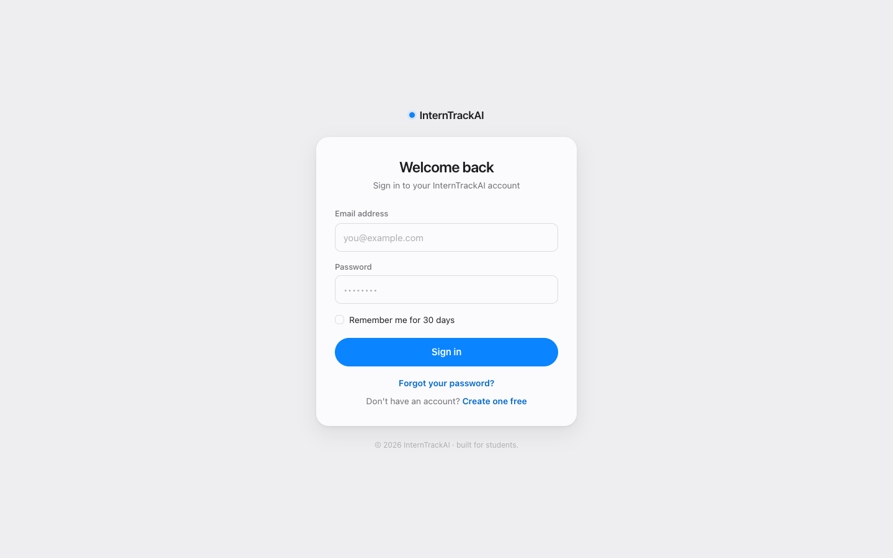 | 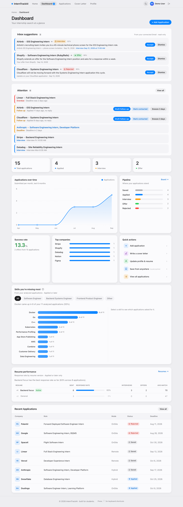 |

| Applications | Detail Drawer |
|---|---|
| 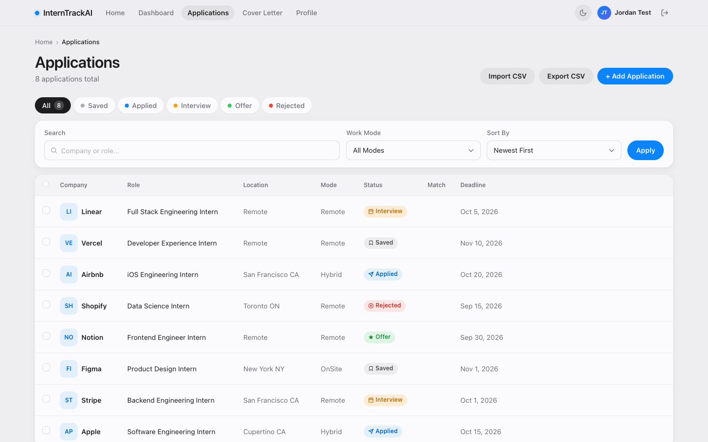 | 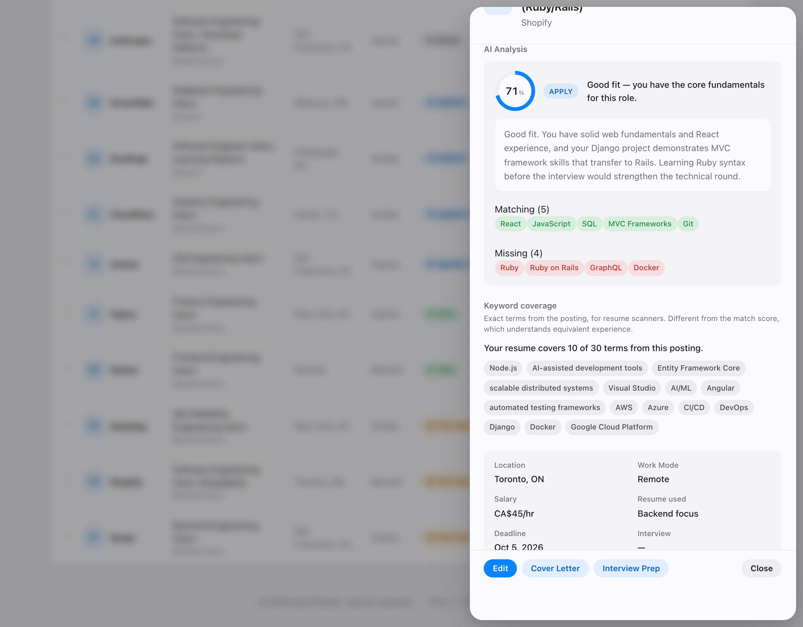 |

| Kanban Board |
|---|
| 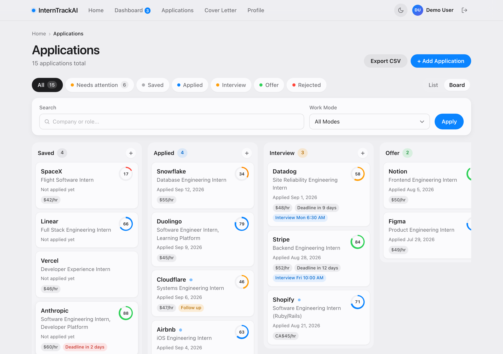 |

| Attention card — overdue, deadline soon, follow-up due, upcoming interview |
|---|
| 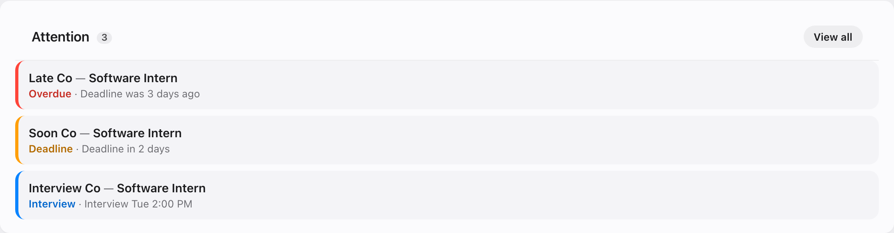 |

| Resume performance — which resume version gets responses |
|---|
| 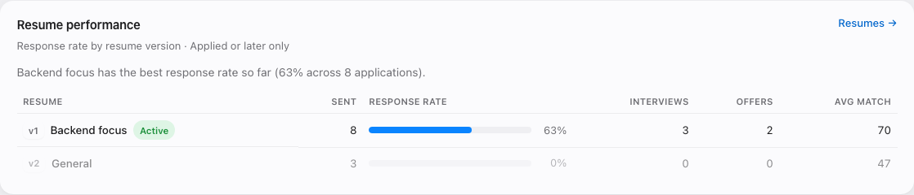 |

| Skills you're missing most — aggregated gaps across analyzed postings |
|---|
| 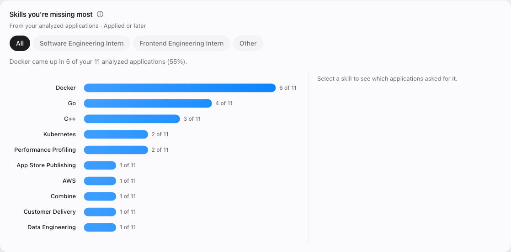 |

| Add Application — AI Analysis + Resume Match |
|---|
| 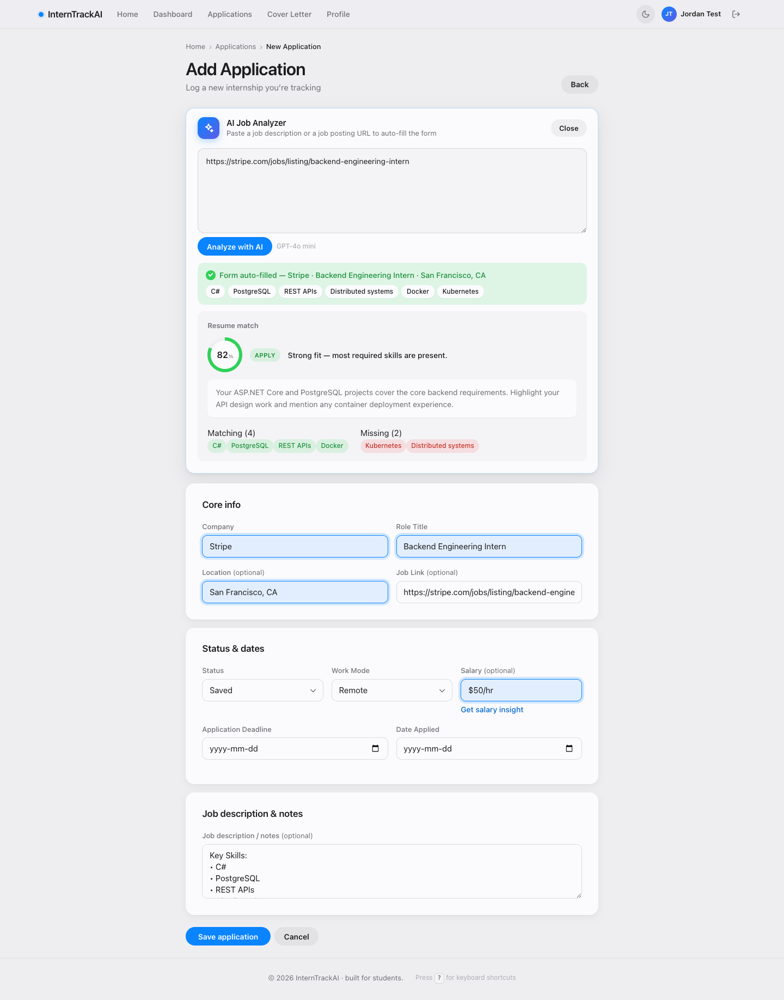 |

| Cover Letter | Interview Prep |
|---|---|
| 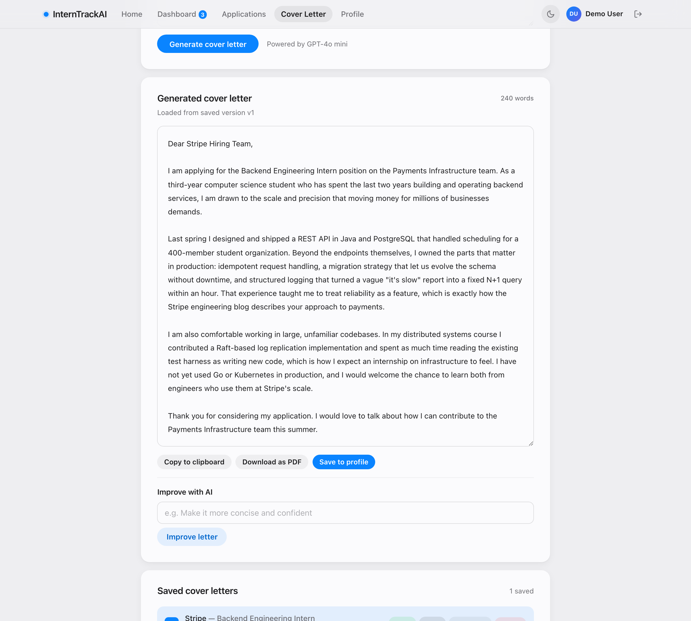 | 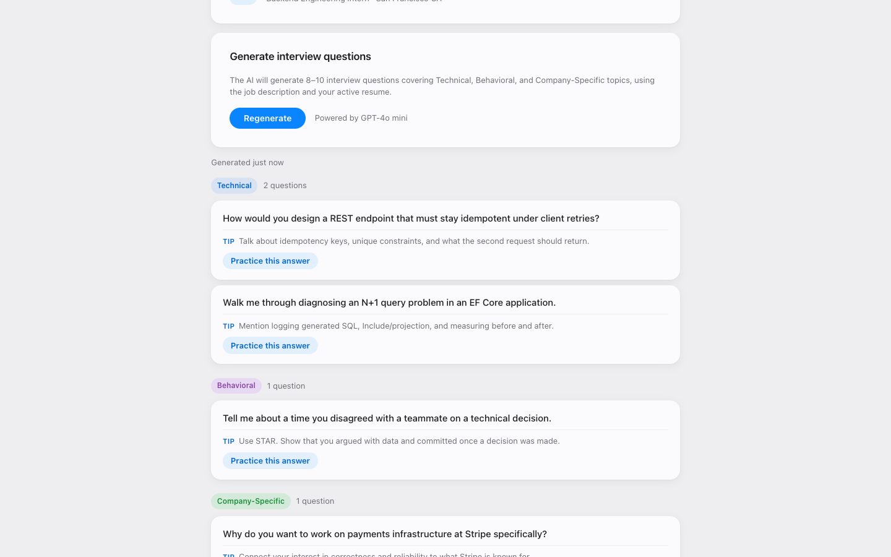 |

| Dark Mode | Profile |
|---|---|
| 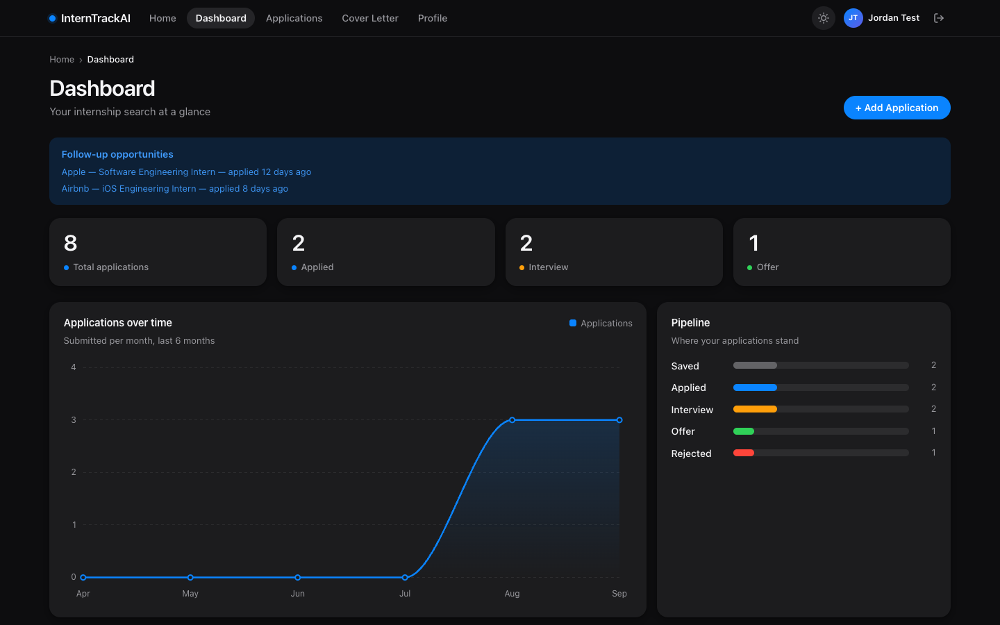 | 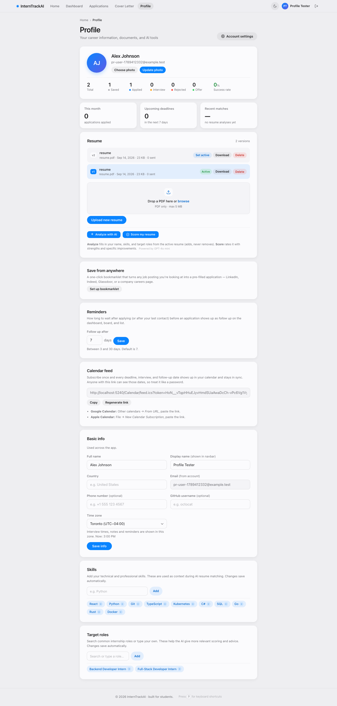 |

| Save-from-anywhere bookmarklet |
|:--:|
| 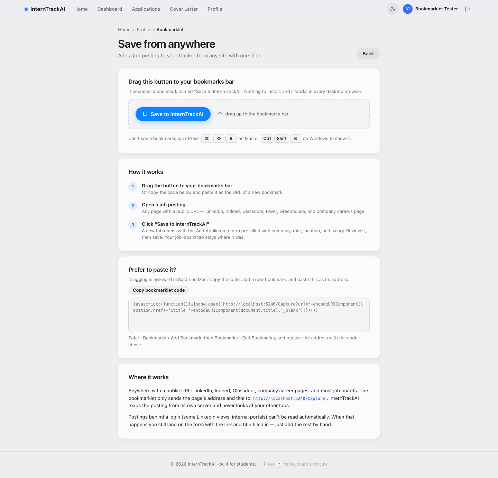 |

| Inbox suggestions — status changes spotted in your Gmail |
|---|
| 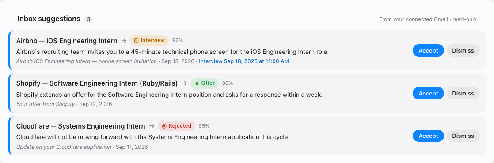 |

## 💻 How to Run Locally

**Prerequisites:** .NET 9 SDK, an OpenAI API key

```bash
git clone https://github.com/MajdArow123/InternTrackAI.git
cd InternTrackAI
```

Set your OpenAI API key using .NET User Secrets (never stored in source files):

```bash
dotnet user-secrets set "OpenAI:ApiKey" "sk-..."
```

Run the app:

```bash
dotnet run
```

Open [http://localhost:5240](http://localhost:5240) and register an account to get started. Locally, the app uses a SQLite file (`app.db`) created automatically via EF Core migrations — no extra database setup needed. Uploaded files go to `./uploads` unless you set `UPLOADS_PATH`.

> AI features require billing credits on your OpenAI account, added at [platform.openai.com/settings/billing](https://platform.openai.com/settings/billing). GPT-4o-mini costs roughly $0.00015 per analysis.

Optional: to enable the one-click **Try the live demo** button locally, point it at any account you've registered:

```bash
dotnet user-secrets set "Demo:Email" "you@example.com"
dotnet user-secrets set "Demo:Password" "your-password"
```

### Optional: Gmail status suggestions (Google OAuth)

The Gmail integration is off until both Google keys are present; without them the app runs exactly as before (no Gmail card, no background job). To turn it on:

1. Create a project in the [Google Cloud console](https://console.cloud.google.com/) (or reuse one).
2. **APIs & Services → Library**: enable the **Gmail API**.
3. **APIs & Services → OAuth consent screen**: External, keep it in **Testing**, add the scope `https://www.googleapis.com/auth/gmail.readonly` and add your Gmail address under *Test users* (Testing mode is enough for a personal deployment; Google caps it at 100 test users).
4. **Credentials → Create credentials → OAuth client ID**, type *Web application*, with these two **Authorized redirect URIs**:
   - `http://localhost:5240/Integrations/Gmail/Callback`
   - `https://<your-app>.up.railway.app/Integrations/Gmail/Callback`
5. Store the client id and secret — locally in user secrets, on Railway as the two environment variables:

```bash
dotnet user-secrets set "Google:ClientId" "1234567890-abc.apps.googleusercontent.com"
dotnet user-secrets set "Google:ClientSecret" "GOCSPX-..."
```

Then open **Profile → Connected accounts → Connect Gmail**. Every time the flow starts the app logs the exact `redirect_uri` it sends to Google (`Starting Gmail OAuth flow ... redirect_uri ...`), so a `redirect_uri_mismatch` can be checked against the console entry. Behind Railway the app derives the `https://` origin from the proxy's `X-Forwarded-*` headers; `Google__RedirectBaseUrl` overrides that derivation if you ever need to pin it. The background sync runs every `Gmail:SyncIntervalMinutes` (default 30); **Sync now** on the profile runs one immediately and reports what it found.

**Privacy.** Only the `gmail.readonly` scope is ever requested — the app cannot send, modify, label or delete mail. Email bodies are read once for classification and never stored: a suggestion keeps the subject, sender, date, Gmail message id and the AI's one-sentence summary. OAuth tokens are encrypted at rest with ASP.NET Data Protection, and **Disconnect** revokes the grant with Google before deleting the row. Each AI classification counts against the same per-user AI rate limit as every other AI feature.

## ☁️ Deployment

The live instance runs on [Railway](https://railway.app), built directly from the `Dockerfile` in this repo:

- **Database** — Railway-managed PostgreSQL. `Program.cs` detects the `DATABASE_URL` environment variable Railway injects and switches the EF Core provider from SQLite to Npgsql automatically.
- **Persistent storage** — uploaded resumes and profile photos are written to the directory named by `UPLOADS_PATH`, which points at a mounted Railway volume so files survive redeploys. Resumes are never served as static files; only profile photos are public.
- **Data Protection keys** — persisted to the database so antiforgery tokens and cookies stay valid across container restarts.
- **Migrations** — applied automatically on startup, so deploying a new migration is just a `git push`.
- **Health check** — `GET /health` returns `{"status":"Healthy"}` (HTTP 200) when the database answers and 503 otherwise. `railway.toml` already sets `healthcheckPath = "/health"`; if you configure the service by hand, set **Settings → Deploy → Healthcheck Path** to `/health`.
- **Logging** — Serilog writes structured lines to the console (which Railway captures): one line per request with method, path, status, duration, and user id. No bodies, headers, cookies, or secrets are logged. Override levels with a `Serilog__MinimumLevel__Default` variable if needed.
- **Gmail sync job** — `GmailSyncHostedService` syncs every connected Gmail account every 30 minutes (`Gmail__SyncIntervalMinutes`), one account at a time so one expired token never blocks the others. It logs counts only, never email content, and stays idle when the Google keys are absent (the startup log says which).
- **Demo account reset** — `DemoResetService` can wipe the demo account nightly and reseed 15 realistic applications, notes, three pending inbox suggestions, and a saved cover letter (the profile and active resume are kept; a second labelled resume version is added and the applications are split between the two so the Resume performance card shows a comparison; the profile's target roles are reset to three demo roles and its display name to "Demo User" and the seeded missing skills give the skill gap card a clear top skill, a mid tier and a tail). It is off unless `Demo__AutoReset=true`. Sign in as the `Admin__Email` account and open `/Admin/ResetDemo` to run the same reseed by hand and check the result before turning the nightly job on. The startup log states whether auto-reset is enabled.

To deploy your own copy: create a Railway project, add a PostgreSQL service, attach a volume (mounted at `/data`), point Railway at this repo, and set these variables on the service — `railway.toml` already configures the build and health check.

| Variable | Purpose |
|---|---|
| `OpenAI__ApiKey` | OpenAI API key for all AI features |
| `UPLOADS_PATH` | Upload root on the volume, e.g. `/data/uploads` |
| `Demo__Email` / `Demo__Password` | Optional. Credentials of the account behind the **Try the live demo** button; leave unset to hide it |
| `RateLimiting__AI__PermitLimit` | Optional (default `20`). AI requests allowed per user per window, across all AI features |
| `RateLimiting__AI__WindowMinutes` | Optional (default `60`). Length of the rate-limit window |
| `RateLimiting__AI__DemoPermitLimit` | Optional (default `10`). Tighter allowance for the shared demo account |
| `Demo__AutoReset` | Optional (default `false`). When `true` (and `Demo__Email` is set) the demo account is wiped and reseeded every night |
| `Demo__ResetTimeUtc` | Optional (default `04:00`). Time of day, UTC, for the nightly demo reset |
| `Admin__Email` | Optional. The one account allowed to call `POST /Admin/ResetDemo` (manual reseed); unset disables the endpoint |
| `Capture__AnalyzeTimeoutSeconds` | Optional (default `15`). How long the bookmarklet's `/Capture` endpoint waits for the AI analyzer before falling back to manual entry |
| `Google__ClientId` / `Google__ClientSecret` | Optional. Google OAuth web-client credentials for **Gmail status suggestions**; leave both unset to hide the feature entirely |
| `Google__RedirectBaseUrl` | Optional. Public origin (e.g. `https://<your-app>.up.railway.app`) used verbatim for the Gmail OAuth `redirect_uri`. Normally unnecessary: the app trusts Railway's `X-Forwarded-Proto`/`X-Forwarded-Host` headers and derives the https origin itself. Set it only if the redirect URI logged at the start of the flow ever differs from the one registered in the Google console |
| `Gmail__SyncIntervalMinutes` | Optional (default `30`). How often connected Gmail accounts are synced in the background |

(`DATABASE_URL` and `PORT` are injected by Railway automatically.)

## License

Released under the [MIT License](LICENSE).

## Author

**Majd Arow** — [GitHub](https://github.com/MajdArow123) · [LinkedIn](https://www.linkedin.com/in/majd-arow-92b97719a)
