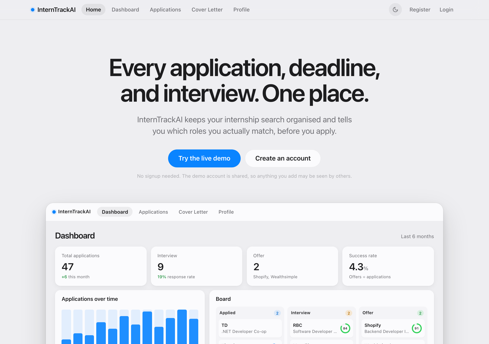

# InternTrackAI

**Your internship search, organized — with AI doing the busywork.**

[](https://github.com/MajdArow123/InternTrackAI/actions/workflows/ci.yml)
[](https://dotnet.microsoft.com/)
[](https://learn.microsoft.com/aspnet/core)
[](https://platform.openai.com/)
[](https://interntrackai.majdarow.com)
[](LICENSE)

InternTrackAI is a full-stack internship application tracker built with ASP.NET Core 9 MVC. It replaces the typical spreadsheet with a real pipeline: paste a job posting and let AI fill out the form, see instantly how well your resume matches, track every application through five stages, and generate cover letters and interview prep on demand — all in one place, in a clean Apple-style interface with full dark mode.



## 🚀 Live Demo

**[interntrackai.majdarow.com](https://interntrackai.majdarow.com)**

Click **Try the live demo** on the landing page to be signed straight into a shared demo account — no
signup. It comes preloaded with a profile, two resume versions and 15 applications spanning every
match-score tier, so every card and chart has real data behind it. The account is wiped and reseeded
nightly, so explore freely: add, edit and delete applications, and try the AI features.

> Please don't change the demo account's password or delete its profile — it's shared.

## ✨ Key Features

**AI tools**

- 🧠 **Job analyzer** — paste a job description or URL and the form auto-fills with company, role, location, salary, required skills, and the application deadline when the posting states one
- 🎯 **Resume match scoring** — a 0–100 match ring for every role, with matched and missing skills side by side and a plain-language summary
- ✍️ **Cover letter generator** — a personalized letter written from the posting, your resume, and your profile; improve it with a one-line instruction, save versions, and download as PDF
- 📨 **Follow-up email drafts** — for every application that's waiting on a reply, *Draft follow-up* (on the dashboard Attention card and in the application drawer) writes a short, specific follow-up from what the app already knows: the posting, when you applied, your profile, resume, saved cover letter and notes. A second follow-up acknowledges the first, a 30+ day wait becomes a brief closing-the-loop check, and it never invents referrals, names or timelines. Edit it in place, revise it with a one-line instruction, and copy subject and body into your mail client; nothing is stored
- 🪄 **Resume bullet rewriter** — paste one bullet from your resume, pick an application, and get two or three rewrites aimed at that posting: one leading with impact, one with the technical approach, one short and blunt. It uses the posting's vocabulary only where it fits, never invents a technology or a metric (where a number belongs it leaves a highlighted `[X]%` for you to fill in), and copies each version in one click
- 🎤 **Interview prep** — technical, behavioral, and company-specific questions with tips, plus AI feedback on your written answers
- 💵 **Salary insight** — a typical pay range for the role, company, and location while you're filling in the form
- 📄 **Resume tools** — every upload auto-fills your name, skills, and target roles from the resume (adds, never removes; re-run any time with Analyze with AI), and Score my resume rates it with strengths and improvements

**Tracking**

- 📋 **Five-stage pipeline** — Saved, Applied, Interview, Offer, Rejected, with status filter pills, search, and sorting
- 🗂️ **Kanban board** — drag cards between Saved, Applied, Interview, Offer, and Rejected columns (or move them with the keyboard); order and status save instantly, with the same filters as the list
- 📂 **Detail drawer** — the full posting, AI analysis, key details, a status timeline, and a notes log without leaving the list
- ✅ **Bulk actions** — select rows to change status, delete, or compare up to three applications side by side
- 📊 **Dashboard** — headline stats, an applications-over-time chart, a pipeline funnel, top companies, and an **Attention** card
- 📈 **Resume performance** — every application records which resume version it was sent with (defaults to the active resume, changeable on Create/Edit), and the dashboard compares versions side by side: applications sent, response rate (Interview or Offer), interviews, offers and average match score, with a computed one-line takeaway such as *"Backend focus has the best response rate so far (63% across 8 applications)"*. Rows with fewer than 5 applications are greyed as low confidence; resumes can be named inline on the profile, where each one also shows its sent count and response rate
- 🔤 **Keyword coverage (ATS check)** — the blunt counterpart to the match score: it pulls the exact terms a posting uses and lists the ones your resume doesn't literally contain, with *"your resume covers 23 of 31 terms from this posting"* as the headline. Hover any chip to see the sentence it came from so you can judge whether it's worth working into your own wording. Matching is literal and on word boundaries — a posting asking for **SQL** isn't covered by a resume that only says **PostgreSQL**, and the chip tells you that's why — while genuine variants (JS/JavaScript, K8s/Kubernetes, Postgres/PostgreSQL) are folded through a small alias map. It runs in the application drawer, on the edit page and on the add form as soon as you paste a posting. No AI call, so it's instant, free, and always checks whichever resume is active right now
- 🧩 **Skills you're missing most** — the dashboard aggregates the missing skills stored by every resume match (Applied or later; Saved is left out) into a ranked bar chart with a computed takeaway such as *"Docker came up in 6 of your 11 analyzed applications (55%)"*. Skills are compared case-insensitively and obvious variants are merged through a small alias map (Postgres → PostgreSQL, K8s → Kubernetes); pills filter by target role without a reload, and clicking a bar lists the applications behind it, each opening its drawer. No AI calls, and the card stays hidden until 3 applications have match data
- 🔔 **Follow-up reminders and deadline tracking** — one rule set (`ReminderService`) flags applications that are overdue (deadline passed, still Saved), due soon (deadline within 7 days), waiting on a reply (Applied for longer than your follow-up window, 3–30 days, set on the profile), or have an interview in the next 14 days. They show up on the dashboard with *Mark contacted* / *Snooze 3 days* buttons, as chips on the board, in the drawer, and behind a **Needs attention** filter on the list
- 📅 **Calendar export** — a private iCalendar feed URL (subscribe from Google Calendar or Apple Calendar; regenerate it any time) with every deadline, interview, and follow-up date, plus a one-click *Add to calendar* file for a single application
- 🌍 **Per-user time zone** — pick your IANA zone on the profile page; interview times, follow-up dates, note timestamps and every "N days" reminder are entered and shown in that zone while storage stays UTC, and the calendar feed emits interviews as local time with `TZID` + `VTIMEZONE` so Google and Apple Calendar show the right hour
- 🔁 **CSV import and export** — move your data in and out in one click
- 📬 **Gmail status suggestions** — connect your Gmail (read-only) and InternTrackAI watches for mail from the companies you've applied to; an AI pass turns interview invitations, offers and rejections into one-line suggestions on the dashboard, in the application drawer and as a dot on board cards. Accept applies the status (and the interview time when the email names one) and notes the change on the application; Dismiss just records your decision. Syncs every 30 minutes in the background or on demand from the profile
- 🔖 **Save from anywhere bookmarklet** — drag a button to your bookmarks bar, click it on any job posting (LinkedIn, Indeed, Glassdoor, company career pages), and a new tab opens with the Add Application form pre-filled by the AI analyzer; if a posting can't be read (login-walled pages), the form still opens with the link and title filled in

**Profile and account**

- 👤 **Profile** — photo, basic info, skill and target-role chips, versioned resumes with an active version, and your public GitHub repos
- 🌗 **Dark / light mode** — Apple-style design system with soft surfaces, pill buttons, and a frosted navbar; the toggle persists across sessions
- ⌨️ **Keyboard shortcuts** — press `?` anywhere for the list
- 🔐 **Account management** — register, sign in, forgot/reset password (real email via Resend), display name, and change password via ASP.NET Core Identity

## 🛠️ Tech Stack

| Layer | Technology |
|---|---|
| Framework | ASP.NET Core 9 (C#) |
| Database | SQLite (local) / PostgreSQL (production), via Entity Framework Core 9 |
| Frontend | Razor views, Bootstrap 5 (restyled with a custom token-based design system), vanilla JavaScript, Chart.js, jsPDF — no SPA framework |
| AI | OpenAI API (GPT-4o-mini) |
| Auth | ASP.NET Core Identity |
| Hosting | Railway (Docker) |

## 📸 Screenshots

_Captured against the demo account's seed data, so every card has real content behind it._

**Dashboard** — headline stats, applications over time, the pipeline funnel, and the three cards that do the
thinking: **Attention** (overdue, deadline soon, waiting on a reply, interview coming up), **Skills you're
missing most**, and **Resume performance**.


**Kanban board** — drag between the five stages, with match rings, deadline chips and inbox-suggestion dots
on the cards.


**Detail drawer** — the AI match score and skill breakdown, and below it **keyword coverage**: the posting's
exact terms your resume doesn't literally contain.


**Cover letter generator** — written from the posting, your resume and your profile, then editable in place
and revisable with a one-line instruction.


**Profile** — versioned resumes with per-version response rates, the bullet rewriter, reminder window,
private calendar feed, skills and target roles.


## 💻 How to Run Locally

**Prerequisites:** .NET 9 SDK. An OpenAI API key is optional — without one the app runs normally and the AI
features report that they aren't configured.

```bash
git clone https://github.com/MajdArow123/InternTrackAI.git
cd InternTrackAI
dotnet user-secrets set "OpenAI:ApiKey" "sk-..."   # optional
dotnet run
```

Open [http://localhost:5240](http://localhost:5240) and register an account. Locally the app uses a SQLite
file (`app.db`) created automatically by EF Core migrations — no database setup needed. Uploads go to
`./uploads` unless you set `UPLOADS_PATH`.

Email is off locally: without a `Resend:ApiKey` the password-reset link is written to the console instead of
being sent, so you can copy it straight out of the log. See
[docs/deployment.md](docs/deployment.md#email) to configure real sending.

> AI features need billing credits on your OpenAI account, added at
> [platform.openai.com/settings/billing](https://platform.openai.com/settings/billing). GPT-4o-mini costs
> roughly $0.00015 per analysis.

Run the tests with `dotnet test InternTrackAI.sln`.

## 📚 Documentation

- **[Deployment](docs/deployment.md)** — the full environment-variable table, Railway setup (volume,
  health check, auto-migrate on push), and the PostgreSQL migration gotcha to read before adding a migration.
- **[Gmail setup](docs/gmail-setup.md)** — the Google Cloud OAuth walkthrough for the optional inbox
  suggestions feature, and what the app does and doesn't do with your mail.

## License

Released under the [MIT License](LICENSE).

## Author

**Majd Arow** — [GitHub](https://github.com/MajdArow123) · [LinkedIn](https://www.linkedin.com/in/majd-arow-92b97719a)
